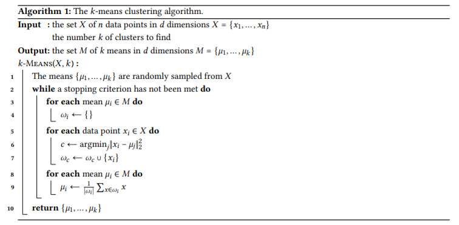

# The k-means Clustering Algorithm in MapReduce

The problem of partitioning a set of unlabeled points into clusters appears in a wide variety of applications. One of the most well-known and widely used clustering algorithms is Lloyd's algorithm, commonly referred to simply as the *k-means* clustering algorithm. The popularity of *k-means* is due in part to its simplicity - the only parameter which needs to be chosen is *k*, the desired number of clusters - and also its speed

Let  be a set of *n* data points, each with dimension *d*. The *k-means* problem seeks to find a set of *k* points (called means)  which minimizes the function

In other words, we wish to choose *k* means so as to minimize the sum of the squared distances between each point in the data set and the mean closest to that point.
Finding an exact solution to this problem is *NP-hard*. However, there are a number of heuristic algorithms which yield good approximate solutions. The standard algorithm for solving the *k-means* problem uses an iterative process which guarantees a decrease in total error (value of the objective function *f(M)*) on each step. The algorithm is as follows:

In other words, the *k-means* algoritm chooses *k* initial means  uniformly at random from the set *X* (line 1). Then, for each point , it finds the closest mean  and adds x to a set  (lines 5-7) initially empty (lines 3-4). Then, for each mean , it recomputes the mean value to be the the centroid of the data points in  (lines 8-9).
These steps are repeated until the means have converged (line 2). The convergence criterion is typically when the total error stops changing between steps, in which case a local optimum of the objective function has been reached.
However, some implementations terminate the search when the change in error between iterations drops below a certain threshold. Each iteration of this algorithm takes time *O(nkd)*. In principle, the number of iterations required for the algorithm to fully converge can be very large, but on real datasets the algorithm typically converges in at most a few dozen iterations.
In this project you must:
1. Design a MapReduce algorithm (using pseudocode) to implement the *k-means* algorithm;
2. Implement the designed MapReduce algorithm using the Hadoop framework;
3. Implement the designed MapReduce algorithm using the Spark framework;
4. Test both implementations on a synthetic or real-world dataset;
5. Write a project report detailing your design, implementations and reporting the experimental results.
For higher marks, please address efficiency issues in your implementation; examples include, but are not limited to, the following:
* Use combiners and/or more than 1 reducer;
* Use custom WritableComparable objects;
* Use the Mapper and Reducer classes adequately;
* Test your implementations on a range of different datasets, i.e., *n* = 1,000, 10,000 and 100,000, *d* = 3 and 7, and *k* = 7 and 13.
